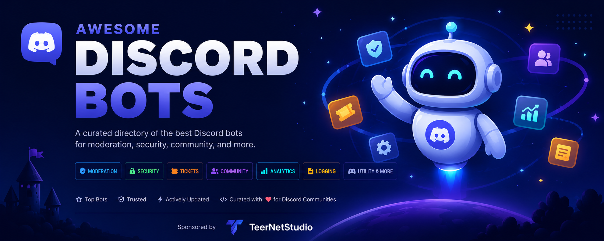

# 🤖 Awesome Discord Bots

**A curated directory of the best Discord bots — organized, compared, and ready to deploy.**

> Discover, compare, and deploy the best Discord bots for your server. Every bot here is actively maintained, documented, and worth your time.

---

## 🧭 Contents

- [Why This Exists](#-why-this-exists)
- [Inclusion Criteria](#-inclusion-criteria)
- [Categories](#-categories)
- [Featured Bots](#-featured-bots)
- [Recommended Stacks](#-recommended-stacks)
- [Roadmap](#️-roadmap)
- [Contributing](#-contributing)

---

## 📖 Why This Exists

There are thousands of Discord bots — most are unmaintained, undocumented, or simply not production-ready.

This directory solves that. Every bot listed here is:

- ✅ **Actively maintained** — no abandonware
- ✅ **Well-documented** — real setup guides, not just invite links
- ✅ **Transparent** — permissions and pricing are clearly listed
- ✅ **Categorized** — organized so you find what you need fast

Whether you run a gaming server, a creator community, a support hub, or a developer workspace — this is your starting point.

---

## ✅ Inclusion Criteria

This is a curated list, not a directory of everything. To be listed, a bot must:

- Be **actively maintained** — functional and updated within the past year
- Have a **working invite link** and basic documentation or support server
- Serve a **clear, defined purpose** — no test bots or personal projects
- **Not violate** [Discord's Terms of Service](https://discord.com/terms) or Developer Policy

> Something outdated or broken? [Open an issue](https://github.com/TeerNetStudio/awesome-discord-bots/issues) and it'll be reviewed.

---

## 📂 Categories

| Category | Description |
|----------|-------------|
| [🛡️ Moderation](categories/moderation.md) | Automod, warnings, mute/ban systems |
| [🔒 Security](categories/security.md) | Anti-raid, anti-nuke, server protection |
| [📜 Logging](categories/logging.md) | Audit logs, message tracking, evidence |
| [🎫 Tickets](categories/tickets.md) | Support systems and helpdesks |
| [🎧 Voice](categories/voice.md) | Join-To-Create and voice management |
| [📈 Community](categories/community.md) | Leveling, engagement, social features |
| [💰 Economy](categories/economy.md) | Currency, jobs, virtual economies |
| [🎮 Arcade](categories/arcade.md) | Games, RPGs, anime, entertainment |
| [🎵 Music](categories/music.md) | Audio streaming and playback |
| [🤖 AI](categories/ai.md) | AI assistants and smart moderation |
| [📊 Analytics](categories/analytics.md) | Server stats and growth insights |
| [📝 Forms](categories/forms.md) | Applications, onboarding, surveys |
| [🎉 Events](categories/events.md) | Giveaways, events, scheduling |
| [✅ Verification](categories/verification.md) | Anti-alt and gate systems |
| [💾 Backup](categories/backup.md) | Server backup and recovery |
| [🧰 Utility](categories/utility.md) | General-purpose tools and helpers |
| [👨‍💻 Developer](categories/developer.md) | GitHub integrations, webhooks, and developer tools |

## 🎯 Finding The Right Bot

New to Discord bots?

Start with these categories:

- 🛡️ Moderation → Manage your community
- 🔒 Security → Protect against raids and nukes
- 🎫 Tickets → Handle support requests
- 🎧 Voice → Temporary voice channels
- 📈 Community → Increase engagement
- 🎮 Arcade → Fun and entertainment
---

## 🏆 Featured Bots

Hand-picked bots that stand out in their category.

| Bot | Category | Free Tier | Dashboard | Why It's Featured |
|-----|----------|:---------:|:---------:|-------------------|
| [Carl-bot](bots/moderation/carl-bot.md) | Moderation | ✅ | ✅ | Best all-round moderation bot — logging, automod, reaction roles |
| [Wick](bots/security/wick.md) | Security | ✅ | ✅ | Industry standard for anti-raid and anti-nuke protection |
| [Ticket Tool](bots/tickets/ticket-tool.md) | Tickets | ✅ | ✅ | Clean, professional ticket system with panel customization |
| [Arcane](bots/community/arcane.md) | Community | ✅ | ✅ | Reliable leveling and engagement with a solid free tier |
| [Statbot](bots/analytics/statbot.md) | Analytics | ⚠️ Limited | ✅ | Most detailed server analytics available |
| [TempVoice](bots/voice/tempvoice.md) | Voice | ✅ | ✅ | The go-to Join-To-Create bot — simple and powerful |
| [UnbelievaBoat](bots/economy/unbelievaboat.md) | Economy | ✅ | ✅ | Most complete economy system with job and shop support |
| [Dank Memer](bots/arcade/dank-memer.md) | Arcade | ✅ | ❌ | Most popular fun and currency bot on Discord |

---

## ⭐ Recommended Stacks

Not sure where to start? These are proven bot combinations for common server types.

<b>🌐 Community Server</b>

| Role | Bot |
|------|-----|
| Moderation | Carl-bot |
| Security | Wick |
| Leveling | Arcane |
| Tickets | Ticket Tool |
| Analytics | Statbot |

<b>🎮 Gaming Server</b>

| Role | Bot |
|------|-----|
| Voice Channels | TempVoice |
| Leveling | Arcane |
| Fun & Economy | Dank Memer |
| Games | Pokétwo |
| Security | Wick |

<b>🎫 Support Server</b>

| Role | Bot |
|------|-----|
| Tickets | Ticket Tool |
| Helpdesk | Helper.gg |
| Modmail | Modmail |
| Moderation | Carl-bot |
| Security | Wick |

<b>🎨 Creator / Content Server</b>

| Role | Bot |
|------|-----|
| Engagement | Arcane |
| Tickets | Ticket Tool |
| Forms | CommunityOne |
| Moderation | Carl-bot |
| Giveaways | GiveawayBot |

<b>👨‍💻 Developer Hub</b>

| Role | Bot |
|------|-----|
| GitHub Integration | GitHub Bot |
| CI/CD Alerts | Sentry |
| Moderation | Carl-bot |
| Tickets | Ticket Tool |
| Security | Wick |

---

## 🗺️ Roadmap

- [x] Repository structure and templates
- [x] Category pages
- [x] Initial bot entries
- [ ] 50+ bots across all categories
- [ ] Per-category comparison tables
- [ ] Setup guides for popular bots
- [ ] Bot reviews section

---

## 🤝 Contributing

Contributions are welcome and appreciated.

**To add a bot:**

1. Check it isn't already listed
2. Make sure it meets the [inclusion criteria](#-inclusion-criteria)
3. Copy [`../templates/bot-template.mdbot-template.md`](../templates/bot-template.mdbot-template.md) into the right `bots/{category}/` folder
4. Add it to the relevant [`categories/{category}.md`](categories/) page
5. Open a Pull Request with a short description

**Other ways to help:**

- Fix broken links or outdated information
- Improve an existing bot's description
- Write a setup guide for a popular bot
- Suggest a new category via [Issues](https://github.com/TeerNetStudio/awesome-discord-bots/issues)

**→ Read [CONTRIBUTING.md](CONTRIBUTING.md) before submitting your first PR.**

---

## ⚠️ Disclaimer

This project is not affiliated with or endorsed by Discord Inc. All bot names, trademarks, and logos belong to their respective owners. Always review a bot's required permissions and privacy policy before adding it to your server.

---

## 📜 License

MIT — see [LICENSE](LICENSE) for details.

---

**Found this useful? A ⭐ helps others discover it.**

